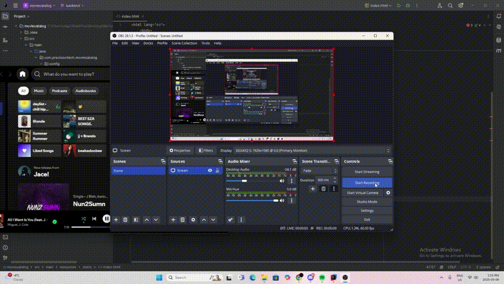

# PrecisionTechCollab
## Name: Precision Technology Inc. ™

# How to Run the Project

## Prerequisites
Before running the project, ensure you have the following installed:
- **IntelliJ IDEA**
- **Maven** (installed and configured)
- **Spring Boot**

## Step-by-Step Guide

### 1. Open the Project in IntelliJ
- Click on **code** and click on download zip
- Unzip the folder and launch **IntelliJ IDEA**.
- Load the project into the IDE.

### 2. Run Maven Lifecycle Commands
- Locate the **Maven** tool window (usually on the right sidebar).
- Search for **Lifecycle** and expand the section.
- Click **Clean** and wait for the process to complete.
- Then, click **Install** and allow Maven to build the project.

### 3. Start the Spring Boot Application
- In the **Maven** tool window, navigate to:
  - **Plugins** → **Spring Boot**
  - Click **spring-boot:run** to start the application.

### 4. Access the Application
- Allow the application to start and once the application is running, open a web browser.
- Enter the following URL: http://localhost:8080/index.html

### Recording

  

# Sources 
This project uses the dataset by **TMDB Movies Dataset (2023)**. Details, including metadata, genres, release data, and other relevant information seen in the project, are from the dataset.

- **Name:** TMDB Movies Dataset (2023)
- **Dataset Source:** [Kaggle Dataset](https://www.kaggle.com/datasets/asaniczka/tmdb-movies-dataset-2023-930k-movies)
- **Provider:** Asaniczka and themoviedb.org
- **License:** ODC Attribution License
